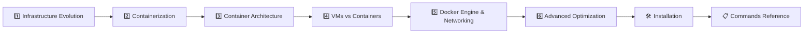

<div align="center">

# 🚀 Infrastructure Evolution & Containerization Guide

### A complete reference for learning infrastructure from physical servers to modern containers

**Author:** Konda Balaji Rao


</div>

---

## 📚 Table of Contents

- [What You'll Learn](#-what-youll-learn)
- [Documentation Structure](#-documentation-structure)
- [Learning Path](#-learning-path)
- [Key Comparisons](#-key-comparisons-covered)
- [Quick Start](#-quick-start)
- [Practical Examples](#-practical-examples)
- [Prerequisites](#-prerequisites)
- [Additional Resources](#-additional-resources)
- [Contributing](#-contributing)
- [Feedback](#-feedback)

---

## 📖 What You'll Learn

A comprehensive, student-friendly guide covering the complete journey from traditional server provisioning to modern containerization and orchestration technologies.

This repository contains a **multi-part learning series** that explains:
- Why companies moved from physical servers to virtual machines to containers
- The cost and performance implications of each technology
- Real-world examples and practical applications
- When to use each technology in your projects

---

## 📁 Documentation Structure

### Part 1: Introduction Series

| | |
|---|---|
| 📘 **Topic** | Infrastructure Evolution & Containerization |
| 🎯 **Level** | Beginner to Intermediate |
| ⏱️ **Read Time** | 30–40 minutes |

#### [📖 Part 1: Infrastructure Evolution](./introduction/Part-1-Infrastructure-Evolution.md)
**From Physical Servers to Virtual Machines**

🎯 **Perfect for:** Complete beginners to DevOps and infrastructure concepts

**What you'll understand:**
- ✅ Why multiple applications can't easily share one server
- ✅ How virtual machines solved isolation problems
- ✅ Cost analysis: $40,000 → $8,000 monthly savings with VMs
- ✅ The resource waste problem that VMs still have
- ✅ Real-world company example (StreamFlix) for context

**Key Topics:**
- Server provisioning and DNS resolution
- Application runtime conflicts (Python 3.7 vs 3.11)
- VMware and hypervisor technologies
- Physical vs VM comparison with real numbers

---

#### [🐳 Part 2: Containerization & Kubernetes](./introduction/Part-2-Containerization.md)
**From Virtual Machines to Containers and Orchestration**

🎯 **Perfect for:** Students ready to learn modern deployment technologies

**What you'll master:**
- ✅ How containers eliminate VM resource waste
- ✅ Performance improvements: 3-minute startup → 2 seconds
- ✅ Docker fundamentals and practical examples
- ✅ When to use Kubernetes for container orchestration
- ✅ Real enterprise examples (Netflix, Spotify)

**Key Topics:**
- Container runtime architecture and Docker
- VMs vs Containers detailed comparison
- Kubernetes container orchestration
- Hands-on getting started guide

---

### Part 2: Container Deep Dive Series

| | |
|---|---|
| 📘 **Topic** | Container Architecture, Docker Engine & Security |
| 🎯 **Level** | Intermediate to Advanced |
| ⏱️ **Read Time** | 60–80 minutes |

#### [🏗️ Chapter 3: Container Architecture & Isolation](./container-deep-dive/3Container-Architecture-and-Isolation.md)
- Container host, client, images, registries, and namespaces
- Monolithic vs microservices architecture
- Nginx deployment and environment setup

#### [⚖️ Chapter 4: Virtualization vs Containerization](./container-deep-dive/4Virtualization-vs-Containerization.md)
- Physical servers, VMs, and containers compared
- Container file system structure and host OS integration
- Why containers are lightweight

#### [🔧 Chapter 5: Docker Engine, Storage & Networking](./container-deep-dive/5Docker-Engine-Storage-and-Networking.md)
- Docker lifecycle, Dockerfile, and container states
- Bind mounts and volumes
- Bridge, host, and overlay networking

#### [🔒 Chapter 6: Advanced Optimization & Security](./container-deep-dive/6Advanced-Optimization-and-Security.md)
- Multi-stage builds and image optimization
- Distroless images for maximum security
- Production-ready Docker strategies

---

### Part 3: Installation

| | |
|---|---|
| 📘 **Topic** | Docker Installation Across All Platforms |
| 🎯 **Level** | Beginner |
| ⏱️ **Read Time** | 10 minutes |

#### [🛠️ Installation Guide](./Installation.md)
- Docker Desktop for Windows (GUI + WSL 2)
- Bare-metal Docker Engine inside WSL 2
- Ubuntu / Debian, CentOS / RHEL, and macOS installation
- Post-installation verification steps

---

### Part 4: Docker Commands Reference

| | |
|---|---|
| 📘 **Topic** | Comprehensive Docker Command Guides with ASCII Diagrams |
| 🎯 **Level** | Beginner to Intermediate |
| ⏱️ **Read Time** | 60–75 minutes (all guides) |

#### [🐳 01 — Images & Run Basics](./Commands/01-Images-and-Run-Basics.md)
- Pulling images, listing, inspecting, and tagging
- Running containers with common flags (`-d`, `-p`, `-v`, `-it`)
- Port mapping flow and image tagging concepts

#### [🔄 02 — Container Lifecycle](./Commands/02-Container-Lifecycle.md)
- Start, stop, restart, and remove containers
- Container state diagram (Created → Running → Stopped → Removed)
- Logs, inspection, exec, and file copy between host and container

#### [🔍 03 — Debugging & Inspection](./Commands/03-Debugging-and-Inspection.md)
- Debugging workflow: logs → inspect → stats → exec → debug
- Targeted inspection with format flags
- Docker Debug tool for distroless images
- Port, network, and connectivity testing

#### [⚡ 04 — Development Workflows](./Commands/04-Development-Workflows.md)
- Interactive development containers with volume mounts
- Live source mounts for real-time development
- Rebuilding and selective service restarts

#### [🐙 05 — Docker Compose](./Commands/05-Docker-Compose.md)
- Multi-container application management
- Scaling services with load distribution
- Multi-stage builds for development and production
- Networking across Compose services

#### [🌐 06 — Networking Fundamentals](./Commands/06-Networking-Fundamentals.md)
- Docker networks, bridge drivers, and DNS resolution
- Network modes comparison: none vs host vs bridge
- Port mapping vs internal container networking
- IPAM and cross-network container communication

#### [🔗 07 — Cross-Network Communication](./Commands/07-Cross-Network-Communication.md)
- Multi-network attachment for reverse proxy setups
- Solving bridge network isolation problems
- Practical example: connecting containers across networks

#### [🌍 08 — Real-World Examples](./Commands/08-Real-World-Examples.md)
- Custom networks with subnet and gateway configuration
- MySQL database deployment with environment variables
- Web app connected to a database container
- Private Docker registry setup and persistent storage

#### [📤 09 — Registry Operations](./Commands/09-Registry-Operations.md)
- Login, tag, push, and pull workflow
- Docker Hub features and capabilities
- Private registries: ECR, GCR, ACR, Harbor, GHCR

#### [🧹 10 — System Maintenance](./Commands/10-System-Maintenance.md)
- Disk usage monitoring (`docker system df`)
- System-wide and targeted cleanup commands
- Understanding dangling vs unused images

#### [💾 11 — Volumes & Mounts](./Commands/11-Volumes-and-Mounts.md)
- Named volumes, bind mounts, and tmpfs mounts
- Data persistence across container restarts
- The `--mount` syntax vs `-v` flag

---

## 🎯 Learning Path

<div align="center">

| Step | Topic | Level | Time |
|:---:|---|:---:|:---:|
| 1 | [Infrastructure Evolution](./introduction/Part-1-Infrastructure-Evolution.md) | 🟢 Beginner | 15 min |
| 2 | [Containerization & Kubernetes](./introduction/Part-2-Containerization.md) | 🟢 Beginner | 20 min |
| 3 | [Container Architecture & Isolation](./container-deep-dive/3Container-Architecture-and-Isolation.md) | 🟡 Intermediate | 20 min |
| 4 | [Virtualization vs Containerization](./container-deep-dive/4Virtualization-vs-Containerization.md) | 🟡 Intermediate | 15 min |
| 5 | [Docker Engine, Storage & Networking](./container-deep-dive/5Docker-Engine-Storage-and-Networking.md) | 🟡 Intermediate | 20 min |
| 6 | [Advanced Optimization & Security](./container-deep-dive/6Advanced-Optimization-and-Security.md) | 🔴 Advanced | 20 min |
| 7 | [Installation Guide](./Installation.md) | 🟢 Beginner | 10 min |
| 8 | [Commands Reference (01–11)](./Commands/01-Images-and-Run-Basics.md) | 🟢–🟡 Mixed | 60 min |

</div>



---

## 💡 Key Comparisons Covered

| Technology | Isolation | Startup Time | Cost/App | Resource Efficiency | Best For |
|-----------|-----------|--------------|----------|-------------------|----------|
| **Physical Servers** | ❌ None | Minutes | $500–2000 | 5–15% | Legacy systems |
| **Virtual Machines** | ✅ Complete | 1–3 min | $50–200 | 30–50% | Mixed environments |
| **Containers** | ✅ Process-level | 1–2 sec | $5–20 | 70–85% | Modern applications |

---

## 🚀 Quick Start

**New to infrastructure concepts?**
```bash
# Step 1: Read Part 1 first — it explains the fundamental problems
# Step 2: Then move to Part 2 for modern solutions
# Step 3: Install Docker using the Installation Guide
# Step 4: Try the commands in the Commands Reference
```

**Already know VMs?**
```bash
# Step 1: Skip to Part 2 for containerization
# Step 2: Install Docker and follow the Installation Guide
# Step 3: Work through the Commands Reference (01–11)
# Step 4: Focus on Compose, Networking, and Volumes
```

> [!TIP]
> Start with [Part 1: Infrastructure Evolution](./introduction/Part-1-Infrastructure-Evolution.md) if you're completely new. It explains *why* containers exist before diving into *how* they work.

---

## 🛠️ Practical Examples

The guide includes:
- 💰 **Real cost calculations** for different infrastructure approaches
- 📊 **Performance benchmarks** comparing technologies
- 🏢 **Enterprise examples** from Netflix, Spotify
- 💻 **Hands-on Docker commands** you can try immediately
- 🔗 **Links to free online playgrounds** for practice
- 🎨 **ASCII diagrams** for visual understanding of concepts

---

## 🎓 Prerequisites

**Part 1 Prerequisites:**
- Basic understanding of what servers and applications are
- Familiarity with IP addresses and web browsers

**Part 2 Prerequisites:**
- Complete Part 1 or equivalent VM knowledge
- Basic command line familiarity (helpful but not required)

**Commands Reference Prerequisites:**
- Docker installed on your machine ([Installation Guide](./Installation.md))
- Basic command line familiarity

---

## 📖 Additional Resources

**Free Online Tools:**
- [Play with Docker](https://labs.play-with-docker.com/) — Browser-based Docker playground
- [Docker 101 Tutorial](https://www.docker.com/101-tutorial) — Official Docker learning path
- [Kubernetes Basics](https://kubernetes.io/docs/tutorials/) — Official K8s tutorials

**Recommended Learning Sequence:**
1. Complete this multi-part guide
2. Try Docker Desktop locally
3. Follow Docker 101 tutorial
4. Explore Kubernetes basics
5. Build your own containerized project

---

## 🤝 Contributing

Found a way to make the explanations even simpler? Have real-world examples to add?

**We welcome:**
- Clearer analogies and explanations
- Additional real-world examples
- More student-friendly diagrams
- Practical exercises and examples

---

## 📧 Feedback

This guide is designed for students learning infrastructure concepts. If anything is unclear or could be explained better, please let us know!

---

<div align="center">

**Ready to start your infrastructure journey?** → Begin with [Part 1: Infrastructure Evolution](./introduction/Part-1-Infrastructure-Evolution.md) 🚀

</div>
