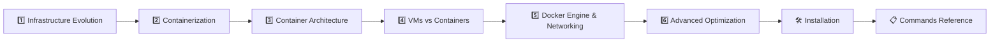

# 🚀 Infrastructure Evolution & Containerization Guide

### A complete reference for learning infrastructure from physical servers to modern containers

**Author:** Konda Balaji Rao

---

## 📁 Documentation Structure

### Part 1: Introduction Series

#### [📖 Part 1: Infrastructure Evolution](./introduction/Part-1-Infrastructure-Evolution.md)
- Server provisioning and DNS resolution
- Application runtime conflicts (Python 3.7 vs 3.11)
- VMware and hypervisor technologies (Type-1 & Type-2)
- Physical servers vs virtual machines comparison

#### [🐳 Part 2: Containerization & Kubernetes](./introduction/Part-2-Containerization.md)
- How containers eliminate VM resource waste
- Docker fundamentals and practical examples
- Kubernetes container orchestration
- Real enterprise examples (Netflix, Spotify)

---

### Part 2: Container Deep Dive Series

#### [🏗️ Chapter 3: Container Architecture & Isolation](./container-deep-dive/3Container-Architecture-and-Isolation.md)
- Container host, client, images, registries, and namespaces
- Monolithic vs microservices architecture
- Nginx deployment and environment setup

#### [⚖️ Chapter 4: Virtualization vs Containerization](./container-deep-dive/4Virtualization-vs-Containerization.md)
- Physical servers, VMs, and containers compared
- Container file system structure and host OS integration

#### [🔧 Chapter 5: Docker Engine, Storage & Networking](./container-deep-dive/5Docker-Engine-Storage-and-Networking.md)
- Docker lifecycle, Dockerfile, and container states
- Bind mounts, volumes, bridge, host, and overlay networking

#### [🔒 Chapter 6: Advanced Optimization & Security](./container-deep-dive/6Advanced-Optimization-and-Security.md)
- Multi-stage builds and image optimization
- Distroless images and production-ready strategies

---

### Part 3: Installation

#### [🛠️ Installation Guide](./Installation.md)
- Docker Desktop for Windows (GUI + WSL 2)
- Bare-metal Docker Engine inside WSL 2
- Ubuntu / Debian, CentOS / RHEL, and macOS installation
- Post-installation verification

---

### Part 4: Docker Commands Reference

#### [🐳 01 — Images & Run Basics](./Commands/01-Images-and-Run-Basics.md)
- Pulling, listing, inspecting, tagging images and running containers

#### [🔄 02 — Container Lifecycle](./Commands/02-Container-Lifecycle.md)
- Start, stop, restart, remove, logs, exec, and file copy

#### [🔍 03 — Debugging & Inspection](./Commands/03-Debugging-and-Inspection.md)
- Logs, inspect, stats, Docker Debug, port and network debugging

#### [⚡ 04 — Development Workflows](./Commands/04-Development-Workflows.md)
- Volume mounts, live source mounts, and selective restarts

#### [🐙 05 — Docker Compose](./Commands/05-Docker-Compose.md)
- Multi-container management, scaling, and multi-stage builds

#### [🌐 06 — Networking Fundamentals](./Commands/06-Networking-Fundamentals.md)
- Bridge, host, none network modes, DNS, port mapping, and IPAM

#### [🔗 07 — Cross-Network Communication](./Commands/07-Cross-Network-Communication.md)
- Multi-network attachment and reverse proxy setups

#### [🌍 08 — Real-World Examples](./Commands/08-Real-World-Examples.md)
- MySQL deployment, web app + database, private registry, volumes

#### [📤 09 — Registry Operations](./Commands/09-Registry-Operations.md)
- Login, tag, push, pull, and private registries (ECR, GCR, Harbor)

#### [🧹 10 — System Maintenance](./Commands/10-System-Maintenance.md)
- Disk usage, system prune, and targeted cleanup commands

#### [💾 11 — Volumes & Mounts](./Commands/11-Volumes-and-Mounts.md)
- Named volumes, bind mounts, tmpfs, and `--mount` syntax

---

## 🎯 Learning Path

| Step | Topic | Level | Time |
|:---:|---|:---:|:---:|
| 1 | [Infrastructure Evolution](./introduction/Part-1-Infrastructure-Evolution.md) | 🟢 Beginner | 15 min |
| 2 | [Containerization & Kubernetes](./introduction/Part-2-Containerization.md) | 🟢 Beginner | 20 min |
| 3 | [Container Architecture & Isolation](./container-deep-dive/3Container-Architecture-and-Isolation.md) | 🟡 Intermediate | 20 min |
| 4 | [Virtualization vs Containerization](./container-deep-dive/4Virtualization-vs-Containerization.md) | 🟡 Intermediate | 15 min |
| 5 | [Docker Engine, Storage & Networking](./container-deep-dive/5Docker-Engine-Storage-and-Networking.md) | 🟡 Intermediate | 20 min |
| 6 | [Advanced Optimization & Security](./container-deep-dive/6Advanced-Optimization-and-Security.md) | 🔴 Advanced | 20 min |
| 7 | [Installation Guide](./Installation.md) | 🟢 Beginner | 10 min |
| 8 | [Commands Reference (01–11)](./Commands/01-Images-and-Run-Basics.md) | 🟢–🟡 Mixed | 60 min |

---

## 📖 Additional Resources

- [Play with Docker](https://labs.play-with-docker.com/) — Browser-based Docker playground
- [Docker 101 Tutorial](https://www.docker.com/101-tutorial) — Official Docker learning path
- [Kubernetes Basics](https://kubernetes.io/docs/tutorials/) — Official K8s tutorials

---

**Ready to start?** → Begin with [Part 1: Infrastructure Evolution](./introduction/Part-1-Infrastructure-Evolution.md) 🚀

